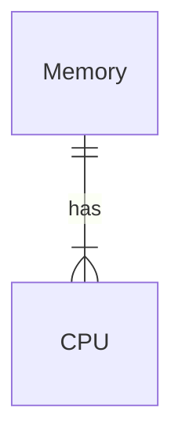

- system call
- memory manager
- precess scheduler
- file system

## Historical Perspective

- Mainframe Systems
- Computer-system architecture
- Special-purpose Systems

## Mainframe Systems

> mainframe: 體積很大

- 最早的電腦 (1954)
- Slow I/O
- Evolution:

- 現在 (2017)，Mainframe 指處理特定事物的機器

### Batch Systems

> **Batch**: 批次，一批接者一批執行

Drawbacks (缺點):

- One job a time
- jobs 間零互動
- CPU **idle** (閒置): Why? I/O too slow

> I/O speed << CPU speed is still a problem now (2022)

### Multi-programming

Target: enhance CPU usage rate

Keep both CPU and I/O devices working at higher rates: A 程式在 I/O 時讓 B 程式使用 CPU

- SPOOLing (Simultaneous Peripheral Operation On-Line)
  - I/O 獨立運作 (無 CPU 干涉)
  - CPU need notifying when I/O is done
- Implementation: memory management + CPU scheduling + I/O system

### Time-sharing

Target: Create an interative system + multiple users at the same

- CPU frequently monitors I/O devices (E.g. keyboard)
- switch jobs
- Implementation: Virtual memory + File system + Process synchronization and deadlock

### Summary

| \            | Batch                  | Multiprogramming | Time-sharing                |
| ------------ | ---------------------- | ---------------- | --------------------------- |
| System Model | Single user Single job | multi prog.      | multi prog., user           |
| Purpose      | Simple                 | 增加資源使用率   | Interactive + Response time |

## Computer-system architecture

- Desktop Systems
- Parallel Systems
- Distributed Systems

### Desktop System: Personal Computers

- I/O devieces: keyboard, mice, screen, printer

### Parallel Systems

aka multiprocessor or tightly coupled system

- More thaen one CPU/core
- Usually communicate through **shared memory**
- Symmetric multiprocessor system (SMP)
  - processor 對等
  - 不易 scale
  - require **extensive sychronization** yo protect data integrity
- Aymmetric multiprocessor system (AMP)
  - master-slave
  - for specific tasks
-  (memory picture) Uniform Memory Access (UMA):

### Distributed Systems

- Each processor has its own local memory
- client-server, peer-to-peer

Purposes:

- 分擔工作 (load sharing)
- Reliability: all computers are independent

#### Clustered Systems

Definition: Cluster computers share storage and are closely linked via a local area network or a faster interconnect, such as InfiniBand (up to 300Gb/s)

## Special-purpose Systems
