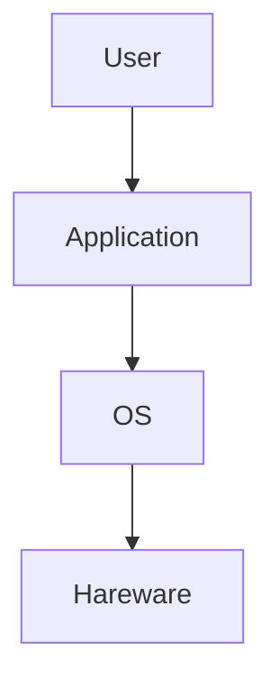
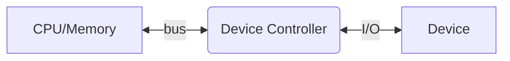

# Outline

- What is an OS?

An OS is the "permanent" software that controls/abstracts hardware resources for user applications

- Computer-System Organization
  - Goal: **Concurrent** execution of CPUs and devices competing for memory cycles
- HW Protection (not security)

> Protecion: 在正常的使用情況下，使用者 A 不會影響使用者 B

## Computer System

For components:

- User: people, machines, other computer

> IoT: device talk to device

- Application: compiler, browser, text editor, assembler, application programs
- OS: **Control** and **coordinate** the use of the hardware/resources
- Hardware: CPU, Memory Device => provides basic **computing resources**

## OS

Definition of an OS

- Resource allocator: manage and allocate resources to insure efficieny and fairness
- Control program: contral the execution of user programs and operations of I/O devices to prevent errors and improper use of comupter
- **Kernal** (OS 別名): the one program running at all times

Importance of an OS

- System are the only interface between user applications and hardware
- OS code cannot allow any bug
  - Any break causes reboot

## Computer System Operations

- **I/O** is from the device to controller's local buffer
- CPU moves data from/to memory to/from local buffer in device controllers

> CPU controls device controller  
> How to do? E.g. Busy/wait (bad way), Interupt 

