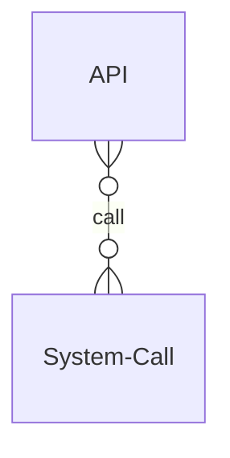

# Nacho OS

- OS runs on OS (virtual machine)
- MIPS instructions (not x86)

---

# OS Structure

- OS Services
- OS Application Interface (API and System call are different)
- OS Structure

## OS Services

- User Interface: CLI, GUI

> Shell: Command-line interpreter (CSHELL, BASH) => customized user preference

## OS Application Interface

> System call !== API

### System call

OS 提供的 function call

- Request OS services
  - Process contral: abort, create, terminate process, allocate/free memory
  - File management
  - Device management
  - Information maintenance
  - Communications
- must make a **software interrupt** (leave user mode)
- usually written by assembly language

### API

- Users mostly prgram against API instead of syetem call
- Commonly implemented by language libraries, e.g. C library
- Three most common APIs
  - Win32 API (Windows)
  - POSIX API (Mac, Linux)

  > Portable Operating System Interface for Unix

  - JAVA API (for JVM)

---

## OS Structure

