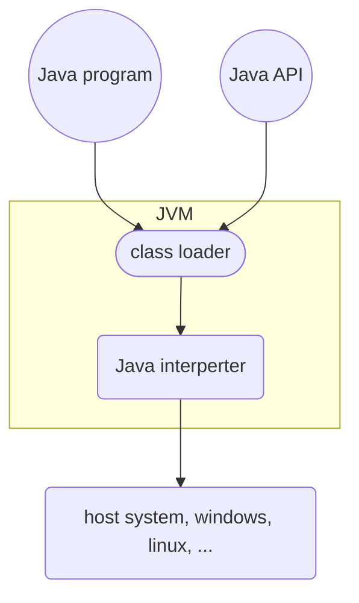
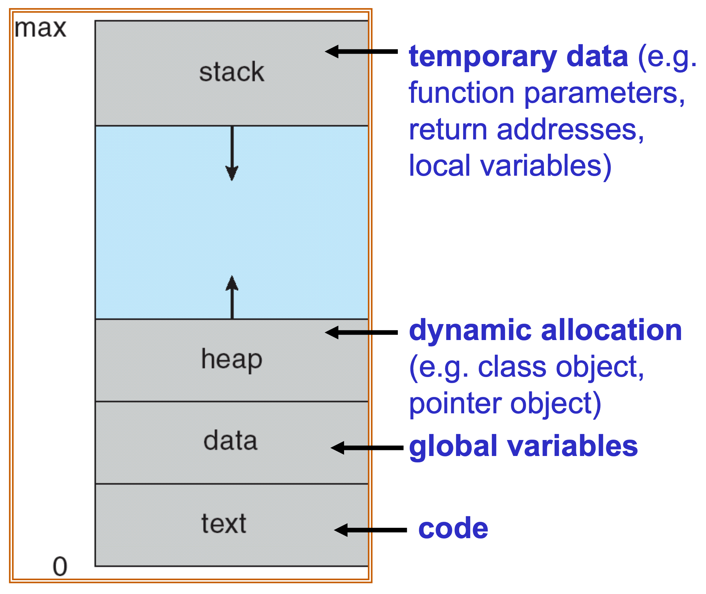
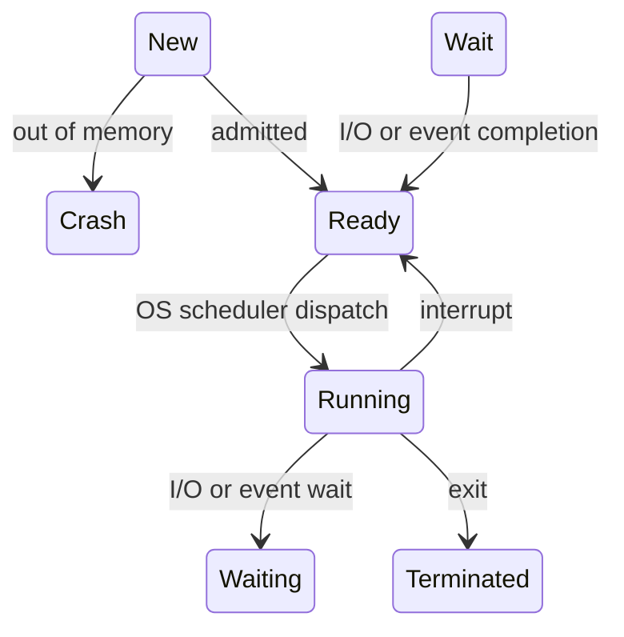
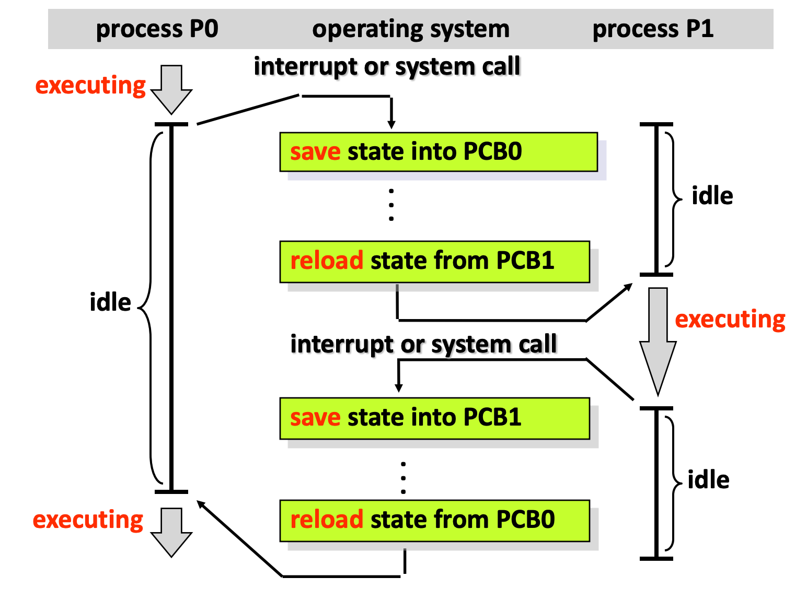

## OS System Structure

- Simple OS Architecture
  - Only one or two levels of code
  - Drawbacks: unsafe, difficult to enhance
- Layer OS Architecture
  - Loser levels independent of upper levels
  - Upper layer can call lower layer's API, but Lower layer cannot call upper layer's API
  - Pros: Easier maintenance
  - Cons: Less efficient, difficult to define layers
- Microkernal OS
  - Modulize
  - Kernel, the smaller the better
  - Communication if provided by **message passing**
- Modular OS Structure
- Virtual Machine
- Java Virtual Machine

### Virtual Machine

> Critical instruction: An instruction has different behaviors in user mode and kernal mode 

#### Usage

- Provides complete protection of system resources
- A way to solve system compatibilty problems
- cloud computing
- etc...

### Java Virtual Machine

- Java bytecodes
- JVM 
  - class loader
  - class verifier
  - runtime interpreter
- JIT (Just in time)

# Processes

## Process Concept

**Process vs Program**

- Program: (passive entity) Binary stored in disk
- Process: (active entity) A program in execution in memory

A process includes:

- Compiled code segment (text section): 程式碼
- Data section: global variables
- Stack: temporary local variables and functions
- Heap: dynamic allocated variables or classes
- Current activity (program counter, register contents)

> program counter: meta data where process executes

- A set of associated resources (e.g. open file handlers)

## Process State

States:

- New: The process is being created
- Ready: the process is in the memory waiting to be assigned to a processor
- Running: instruction are being executed by CPU
- Waiting: the process is waiting for events to occur
- Terminated: the process has finished execution

### Process Control Block (PCB)

- OS created instance
- saved in kernal's own memory
- include: process state, CPU registers, program counter, ...etc.

### Context Switch

Switch a process in CPU to an another process

- Content Switch == PCB load and save
- Overhead (浪費) action
- Switch time (1~1000 ms) depends on
  - memory speed
  - number of registers
  - hardware support: multiple sets of registers