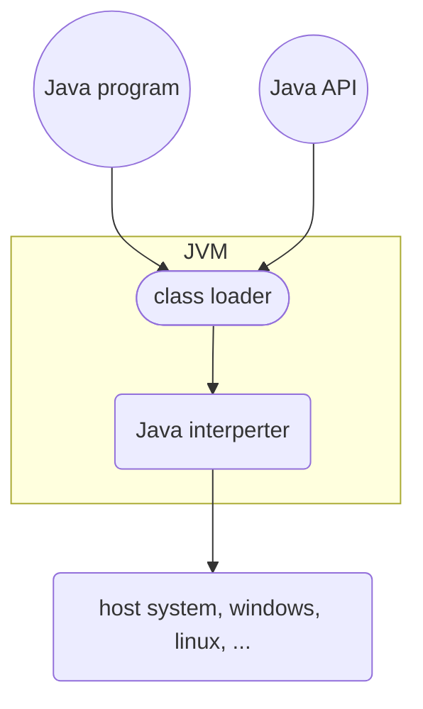

## OS System Structure

- Simple OS Architecture
  - Only one or two levels of code
  - Drawbacks: unsafe, difficult to enhance
- Layer OS Architecture
  - Loser levels independent of upper levels
  - Upper layer can call lower layer's API, but Lower layer cannot call upper layer's API
  - Pros: Easier maintenance
  - Cons: Less efficient, difficult to define layers
- Microkernal OS
  - Modulize
  - Kernel, the smaller the better
  - Communication if provided by **message passing**
- Modular OS Structure
- Virtual Machine
- Java Virtual Machine

### Virtual Machine

> Critical instruction: An instruction has different behaviors in user mode and kernal mode 

#### Usage

- Provides complete protection of system resources
- A way to solve system compatibilty problems
- cloud computing
- etc...

### Java Virtual Machine

- Java bytecodes
- JVM 
  - class loader
  - class verifier
  - runtime interpreter
- JIT (Just in time)
