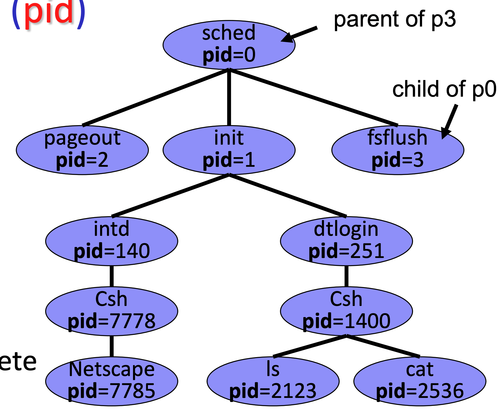
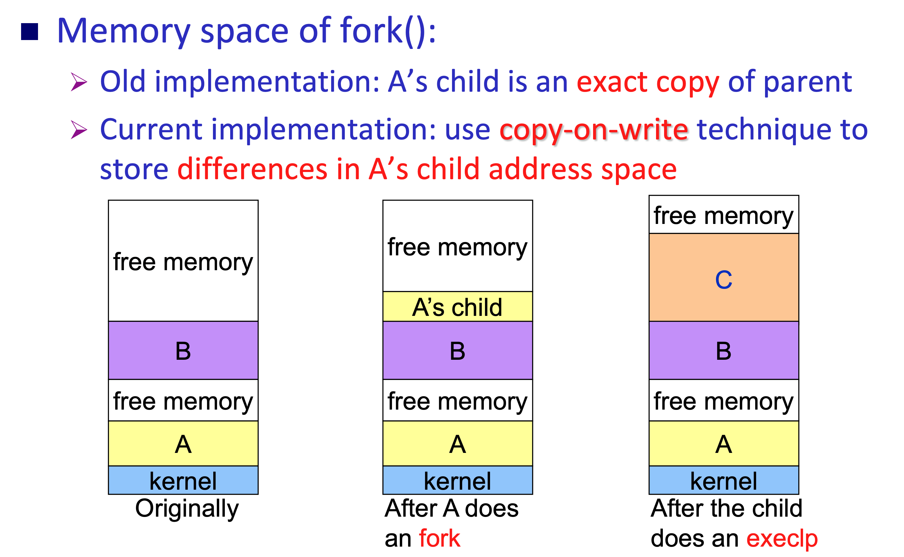

## Scheduler

> Control of Memory

- (頻繁) Short-term scheduler (CPU scheduler) => ready (memory) to run (CPU)
- Long-term scheduler (job scheduler) => new (disk) to ready (memory)
- Medium-term scheduler => ready to wait

### Long-Term scheduler

- Control **degree of multiprogramming** (the number of processes in memory) => should not be to high (crazy swapping) and to low (CPU idle)
- UNIX/NT: no long term scheduler (because current computers usually have enough memory)

### Short-Term scheduler

- Execute quite frequently (e.g. once per 100ms)
- Must be efficient:
  - if 10 ms for picking a job (run algo.), 100 ms for such a pick => overhead (冗余) = 10/110 = 9%

### Medium-Term scheduler

Purpose:

- Improve process mix = improve CPU and I/O
- free up memory

Most mordern OS combine medium-term scheduler with virtual memory

## Tree of Processes

- Each process is identified by a unique processor identifier (pid)

## Process Creation

- Processes are parent-children relationship
- Resource sharing (3 types)
  1. Parent and child processes share all resources
  2. Child process shares subset of parent's resources
  3. Parent and child share no resources
- Two possibilites of execution
  1. Parent and children execute concurrently
  2. Parent waits until children terminate
- Two possibilites of address space
  1. Child duplicate of parent, communication via sharing variables
  2. Child has a program loaded into it, communication via message passing

### UNIX/Linux Process Creation

- **fork** system call
  - Create a new child process
  - The new process **duplcates the address space** of its parent
  - Child and Parent execute **concurrently** after work
  - Child: return value of fork is 0
  - Parent: return value of fork is PID of the child process
- **execlp** system call
  - Load a new binary file into memory => destroyinng the old code (reset memory)
- **wait** system call
  - Can specify which process to run
  - The parent waits for one of its child processes to complete
  - user controls, not system

> copy on write: in runtime, when sharing variables of child and parent are changing in child process, copy parent's variables to child (usage memory of child rises)

## Process Termination

- All resources of the process, including physical & virtual memory, open files, I/O buffers are **de-allocated by OS**
- `exit()`, `abort()`

> `abort()`: terminate specific children processes by its PID, only parent kills children

- Cascading termination: kill exiting parent, kill all its children