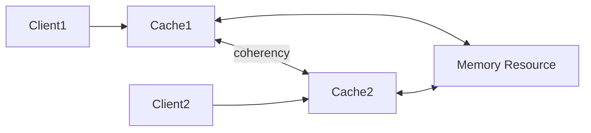
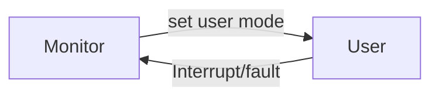

## Interrupt I/O

- Interrupts allows a device to change the flow of control in the CPU
- Modern OS are **interrupt driven** (event driven)
- Hareware may trigger an interrupt at any time by sendinng a **signal** to CPU
- Software may trigger an interrupt either by an error or by a user request for an OS service (**system call**)
- Software interrupt also called trap

## Common Function of Interrupts

- Through interrupt vector (知道 system function 位址)
- Do service routines (interrupt handlers)
- Interrupt architecture 必須紀錄被中斷程式的 address
- Incoming interrupts may be **disable** while another interrupt is being processed => in other to prevent a lost interrupt

## Storage Device Hierarchy

- Main memory: **CPU can access directly**
  - RAM: Random Access Memory
- Secondary storage: non-volatile, CPU cannot access directly

## Caching

> Information in use **copied** from slower to faster storage temporarily (下層還是會有資料)

### Coherency and Consistency issue

- Single task accessing: normally no problem
- Multi-task accessing:

- Distributed system

> one way: give up consistency because users do not have feeling of it

# Hardware Protection

> not security

- Dual-Mode Operation: 區分 os and user program
- I/O Protection
- Memory Protection
- CPU Protection

## Dual-Mode Operation

### What ot protect?

Sharing system resources requires OS to ensure that an incorrect program cannot cause other program to execute incorrectly (application 間不互相影響)

---

- User mode: excution done on behalf of a user (OS 之外)
- Monitor mode: excution done on behalf of OS

> Use mode bit: kernal (0), user (1)

- Privileged instructions 
  - Must exe at monitor mode
  - So users make requests (system calls)

## I/O Protection

- All I/O instructions are privileged instructions

## Memory Protection

- To protect
  - Interrupt vector and the interrupt service routines
  - Data access and over-write from other programs
- HW support:
  - Base register: start point
  - Limit register: how long

  > Memory outside the defined range is protected (無效)

## CPU Protection

- 防止程式霸佔 CPU
- HW support: **Timer** -- interrupts computer after specified period
  - Timer 倒數計時，When Timer reaches the value 0, an interrupt occurs
- Load-timer (override) is a privileged instrcution